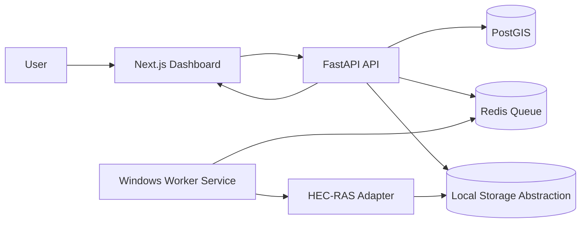

# Hydro Flood Analysis Monorepo (HEC-RAS MVP)

## Architecture Summary (Pre-implementation)

This MVP is intentionally split into four deployable concerns:

1. **Next.js frontend** (`apps/frontend`) for uploads, scenario configuration, job tracking, map preview, and result download.
2. **FastAPI backend** (`apps/api`) for validation, preprocessing orchestration, metadata extraction, job lifecycle state, and REST/SSE APIs.
3. **Queue + data services** (`Redis` + `PostGIS`) managed by Docker Compose.
4. **Windows HEC-RAS worker** (`apps/windows-worker`) that pulls jobs and executes a pluggable adapter interface.

### Key Assumptions

- DEM + stream centerlines alone are **insufficient** for scientifically valid flooding results; user-supplied hydraulic scenario parameters are mandatory.
- HEC-RAS execution happens only on Windows workers with HEC-RAS installed and licensed/configured externally.
- Local Linux/Mac developer flow uses a mock runner that produces deterministic placeholder rasters and logs.
- File storage abstraction starts with local disk but isolates path handling for future S3 migration.
- API stores geometry metadata in PostGIS; actual payload files are stored on disk in mounted volume.

## Mermaid Diagram

## Monorepo Layout

- `apps/frontend`: Next.js + TypeScript UI
- `apps/api`: FastAPI app + job orchestration + GIS preprocessing + tests
- `apps/windows-worker`: Windows queue worker and real/mock HEC-RAS adapter hooks
- `docs/windows-worker-setup.md`: Windows-specific setup and integration points
- `docker-compose.yml`: frontend/api/redis/postgis stack

## Quick Start

### Windows PowerShell

1. From the repo root, run:
   - `.\run.ps1`
2. Open:
   - Frontend: `http://localhost:3000`
   - API docs: `http://localhost:8000/docs`

`run.ps1` copies `apps/api/.env.example` to `apps/api/.env` and `apps/frontend/.env.local.example` to `apps/frontend/.env.local` only if those files are missing, then starts `docker compose up --build`.

By default, the API now requires a real HEC-RAS worker heartbeat file at `/data/worker/hecras-worker.json`. Without that worker registration, jobs fail instead of falling through to the mock runner.

### Manual Start

1. Copy env files if needed:
   - Windows PowerShell:
     - `Copy-Item apps/api/.env.example apps/api/.env`
     - `Copy-Item apps/frontend/.env.local.example apps/frontend/.env.local`
   - Linux/macOS:
     - `cp apps/api/.env.example apps/api/.env`
     - `cp apps/frontend/.env.local.example apps/frontend/.env.local`
2. Start the stack:
   - `docker compose up --build`
3. Open:
   - Frontend: `http://localhost:3000`
   - API docs: `http://localhost:8000/docs`

## Windows Worker (Real HEC-RAS)

See `docs/windows-worker-setup.md` for exact setup and script insertion points.

## TODO: Future HEC-HMS Integration

- Add hydrology module contract for rainfall-runoff to inflow hydrograph generation.
- Add event catalog and return-period frequency analysis service.
- Add HEC-HMS adapter and chained HMS->RAS pipeline orchestration.
- Add uncertainty/sensitivity analysis workflows.

